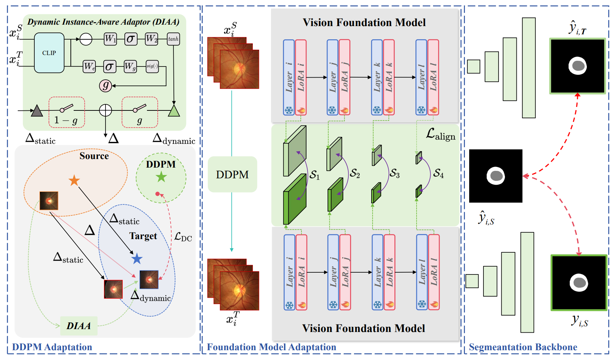

<div align="center">
<h1>MFM-DA</h1>
<h3>MFM-DA: Instance-Aware Adaptor and Hierarchical Alignment for Efficient Domain Adaptation in Medical Foundation Models</h3>
<h3>Keywords: Few-shot domain adaptation, Few-shot image generation, Foundation model, Medical image segmentation.</h3>

Paper: ([2503.00802](https://www.arxiv.org/abs/2503.00802))

</div>

## Abstract
Medical Foundation Models (MFMs), trained on large-scale datasets, have demonstrated superior performance across various tasks. However, these models still struggle with domain gaps in practical applications. Specifically, even after fine-tuning on source-domain data, task-adapted foundation models often perform poorly in the target domain. To address this challenge, we propose a few-shot unsupervised domain adaptation (UDA) framework for MFMs, named MFM-DA, which only leverages a limited number of unlabeled target-domain images. Our approach begins by training a Denoising Diffusion Probabilistic Model (DDPM), which is then adapted to the target domain using a proposed dynamic instance-aware adaptor and a distribution direction loss, enabling the DDPM to translate source-domain images into the target domain style. The adapted images are subsequently processed through the MFM, where we introduce a designed channel-spatial alignment Low-Rank Adaptation (LoRA) to ensure effective feature alignment. Extensive experiments on optic cup and disc segmentation tasks demonstrate that MFM-DA outperforms state-of-the-art methods. Our work provides a practical solution to the domain gap issue in real-world MFM deployment.


## Getting Started
### Installation

**Clone the vHeat repository:**

To get started, first clone the MFM-DA repository and navigate to the project directory:

```bash
git clone https://github.com/HopkinsKwong/MFM-DA.git
cd MFM-DA
```

## Data Preparation
We utilize the publicly available [RIGA+](https://zenodo.org/record/6325549) dataset for our experiments. 

* The ***preprocessed data*** in this article, you can download it ***directly*** via [Baidu Netdisk](https://pan.baidu.com/s/1400JPodPk_zkcBGCspgMfQ?pwd=9dpo) or [Google Drive](https://drive.google.com/file/d/1lIBJTbRy2v6l3zary3YkXp4ZOwDPcrWl/view?usp=sharing) (please cite this article and the REFUGE dataset literature).

### Model Training and Inference

**Synthesis**

To train DDPM model on REFUGE_train (./Syn/DDPM/DDPM_train.zip), use the following commands for different configurations:
```bash
cd MFM-DA/Syn/DDPM
python diffusion.py
```
We also provide the pre-trained DDPM model `model_29000.pth` in `MFM-DA/Syn/DDPM_pretrained_model`. (29000 epochs)

To train MFM-DA-Syn model on REFUGE_train, use the following commands for different configurations:
```bash
cd MFM-DA/Syn/DDPM/MFM_DA_Syn

python train-recon.py --data_path=....../REFUGE_train --ckpt=....../model_29000.pth

python feature-extractor.py --data_path=....../REFUGE_test_10 --save_path=....../MFM-DA-Syn/source_feature.npy

python train-whole-MFM-DA.py --source_path=....../REFUGE_train --target_path=....../REFUGE_test_10 --source_feature_path=....../MFM-DA-Syn/source_feature.npy --target_feature_path=....../MFM-DA-Syn/target_feature_REFUGE_test_10.npy --ckpt_path=....../MFM-DA-Syn/ckpt_recon/recon.pt
```

If you only want to test the Intra-LPIPS performance:

```bash
cd MFM-DA/Syn/DDPM/MFM_DA_Syn

python cal_ic_lpips.py --generated_images_folder REFUGE_test_genetated_images_folder --cluster_centers_folder MFM-DA/Syn/DDPM/REFUGE_test_10
```


**Segmentation**

To perform pre-adaptation segmentation using the generated target domain images:

```bash
cd MFM-DA/Seg

python -m deeplearning.training.run_training_vit_FM
```

To train with `unet`:
```bash
cd MFM-DA/Seg

python -m deeplearning.training.run_training_unet
```


## Citation
If you find this repo useful for your research, please consider citing the paper as follows:
```
@article{jiang2025mfm,
  title={MFM-DA: Instance-Aware Adaptor and Hierarchical Alignment for Efficient Domain Adaptation in Medical Foundation Models},
  author={Jiang, Jia-Xuan and Lei, Wenhui and Wu, Yifeng and Wu, Hongtao and Li, Furong and Xie, Yining and Zhang, Xiaofan and Wang, Zhong},
  journal={arXiv preprint arXiv:2503.00802},
  year={2025}
}
```

## Acknowledgment :sparkles:
This code is based on implementations by ([denoising-diffusion-pytorch](https://github.com/lucidrains/denoising-diffusion-pytorch), [RETFound_MAE](https://github.com/rmaphoh/RETFound_MAE) and [few-shot-diffusion](https://github.com/sjtuplayer/few-shot-diffusion))
